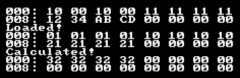

# Description

Read initial DMEM (used by RSP) state

```
10 00 10 00 11 11 11 11
12 34 AB CD 00 00 00 00
```

Then write data from VR4300i to DMEM (offset: 000h) and read data from DMEM again.

```
01 01 01 01 11 11 11 11
21 21 21 21 00 00 00 00
```

The `0x01010101`, `0x1111111111` and `0x21212121` are added in RSP. The result is stored in 000h.

```
0x32323232
```


