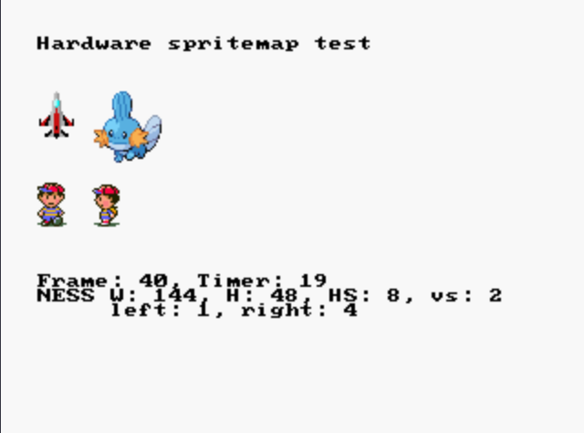

# Description

Example from [libdragon/examples/spritemap](https://github.com/DragonMinded/libdragon/blob/d74706b5962ecbbf4c9faa00075a2843eeebcabe/examples/spritemap/spritemap.c) (modified)

TODO: Use sprites created by myself

