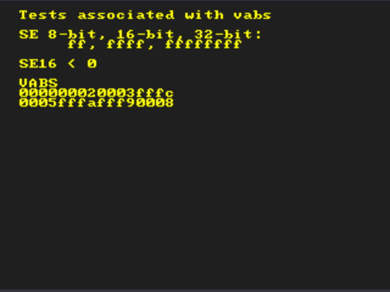

# Description

Tests associated with vabs (See the source code and screenshots for details.)

# Why I made this

I found Dillonb's excellent [RSP test](https://github.com/Dillonb/rsp-ruination) and tried it with my own emulator with confidence and the test failed from the first VABS!

From manual calculations and the results screen, it was evident that although the RSP didn't have issues, there was a problem with the VR4300i. That's why we created this test!

The problem was in the following portion [(Source)](https://github.com/Dillonb/rsp-ruination/blob/caa91c67efecf645250493cac5e4e75f0f1eeb5e/rsp_vector_instructions.c#L568)

```
if (vs->signed_elements[i] < 0)
```

Initially, I suspected this instruction since it internally used the `BGEZ` for branching. However, the actual issue was in the implementation of `SH`. Foolishly, I had used `movsxd` in the JIT implementation of this instruction. My misunderstanding was that I believed the x86_64 `movsxd` instruction sign-extended to 64-bits. In reality, this instruction should not be used when you want to sign-extend from 16-bits to 64-bits! (Please use `movsx` instead). `movsxd` seems to extend the 31st bit. For instance, if `cx` is `FFFFh`, executing `movsxd rax, cx` results in zero-extension.


